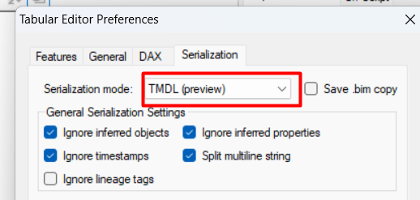
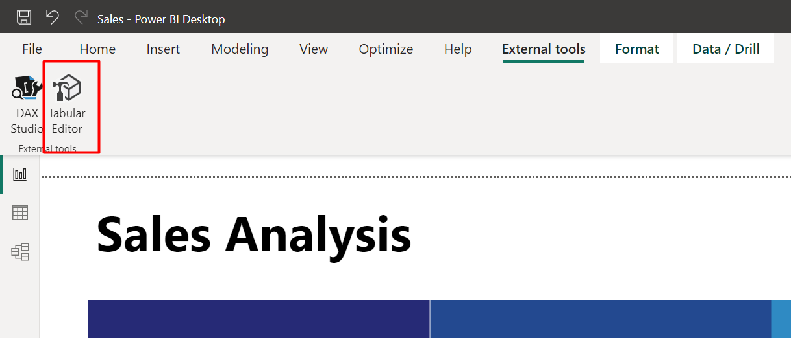
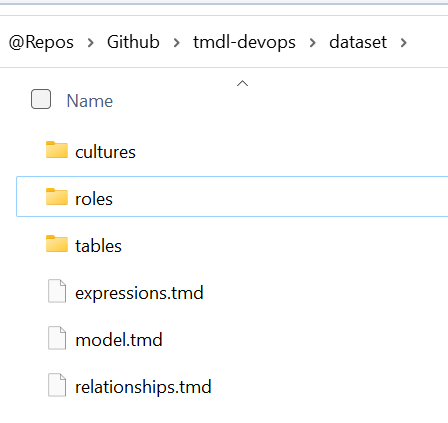
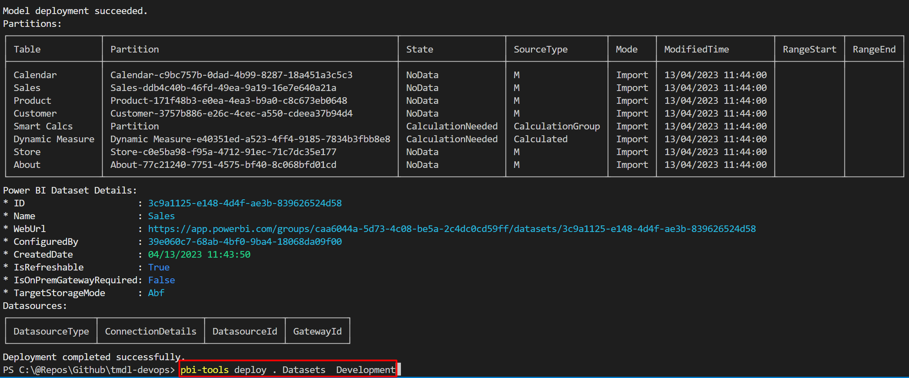
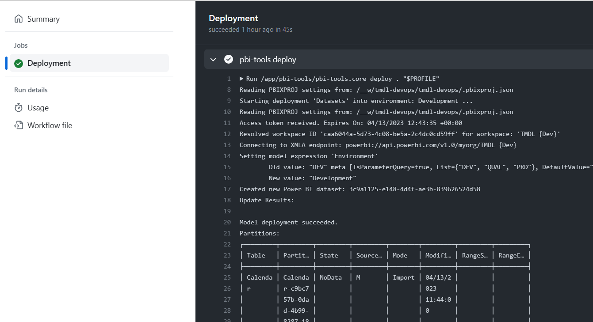

# What is TMDL?

A human readable Tabular Model Definition Language using a YAML-like syntax. Each tabular metadata object has a textual representation with minimal delimiters. Indentation is used to indicate parent-child relationships between objects.

Learn more here:
https://powerbi.microsoft.com/en-us/blog/announcing-public-preview-of-the-tabular-model-definition-language-tmdl/

# Convert PBIX into TMDL using Tabular Editor

Install latest version of [Tabular Editor](https://github.com/TabularEditor/TabularEditor)

Enable TMDL Serialization mode in Tabular Editor Preferences:



Open PBIX in Power BI Desktop and open Tabular Editor External tool:



Save as Folder to save the model definition into TMDL Format:


Navigate to the folder and your model should be serialized using TMDL format:



# Deploy TMDL using pbi-tools

You can use [pbi-tools](https://pbi.tools/) to deploy a dataset using TMDL to a Power BI Premium Workspace.

You must create a [.pbixproj.json](./.pbixproj.json) deployment manifest and configure:

- A service principal that will execute the deployment (learn more [here](https://pbi.tools/devops/release-branching-model/setup-powerbi.html))
- Reference to the TMDL folder ('source' property)
- Workspace environments (Dev, PRD,...)
- Deployment options like parameters, display names, etc

To deploy TMDL you just need to run the following cmdline:

```console
pbi-tools deploy . Datasets Development
```



# Github Actions / DevOps

If you want to automate the deployment everytime, its possible to use [GitHub Workflows](https://docs.github.com/en/actions/using-workflows) or [Azure DevOps Pipelines](https://azure.microsoft.com/en-us/products/devops/pipelines) to run pbi-tools as a docker image.

This repo includes a sample GitHub Workflow that deploys TMDL to a Premium Workspace everytime there is a PullRequest into Main: [deploy.yml](./.github/workflows/deploy.yml)



Sample pipeline for Azure DevOps Pipelines: [azure-pipelines.yml](./azure-pipelines.yml)

# Deploy TMDL using Powershell

See the following repo with an example on how to publish an serialize into TMDL using Powershell:

https://github.com/RuiRomano/tmdl-ps


